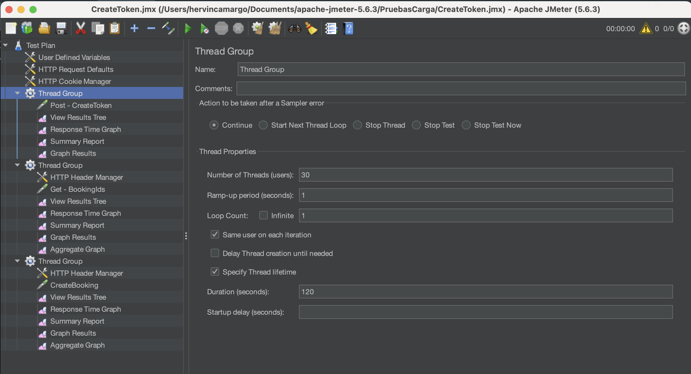

# RetoPerformanceTevolvers

# Prueba técnica
## Automatizacion de pruebas no funcionales

### Herramientas de automatización

<h1 align="center"></h1>

An Open Source Java application designed to measure performance and load test applications.

By The Apache Software Foundation

## What Is It?

Apache JMeter can measure performance and load test static and dynamic web applications.

It can be used to simulate a heavy load on a server, group of servers,
network or object to test its strength or to analyze overall performance under different load types.

## Features

Complete portability and 100% Java.

Multi-threading allows concurrent sampling by many threads and
simultaneous sampling of different functions by separate thread groups.

### Protocols

Ability to load and performance test many applications/server/protocol types:

- Web - HTTP, HTTPS (Java, NodeJS, PHP, ASP.NET,...)
- SOAP / REST Webservices
- FTP
- Database via JDBC
- LDAP
- Message-oriented Middleware (MOM) via JMS
- Mail - SMTP(S), POP3(S) and IMAP(S)
- Native commands or shell scripts
- TCP
- Java Objects

### Escenarios de prueba

- Post
  - create token
- Get
  - BookingIds
  - CreateBooking
- Put
  - pendiente
